# dbq

Run Databricks queries from your terminal or editor.




## Installation and configuration

```
pip3 install dbq
```

Note: libsasl2 is required on your system. On Ubuntu, get it through `sudo apt-get install libsasl2-dev`.

Configuration instructions are be displayed when you run `dbq`.


## Usage

```
dbq [QUERY]
```


## Interactive session

Run `dbq` (without `QUERY`) to start an interactive REPL. Readline is supported, a history file is kept in `~/.dbq_history`.


## Read query from stdin

Specify `-` for `QUERY`. Useful for editor integrations; see next section.


### Integrating with vim

This example binds `ctrl+s` to running the selected text as a query (visual mode) or the subquery that is under the cursor (normal mode).

```
nnoremap <C-s> vi(:w !dbq -<cr>
vnoremap <C-s> :w !dbq -<cr>
```


## Development

For development [pipenv](https://pipenv.kennethreitz.org/en/latest/) is required on your system. Set up the development environment with `make develop`, run with `pipenv run dbq ...` as needed. When submitting pull requests, ensure that `make lint` comes back clean; you can auto format the code with `make format`.


## Legal

Copyright 2019 GetYourGuide GmbH.

dbq is licensed under the Apache License, Version 2.0. See [LICENSE](LICENSE) for the full text.
